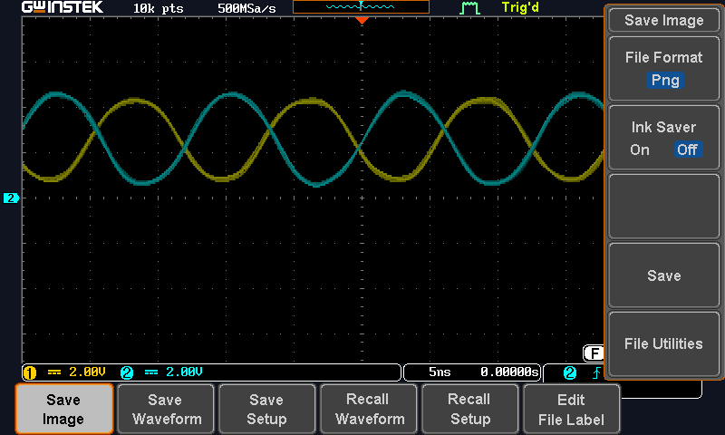
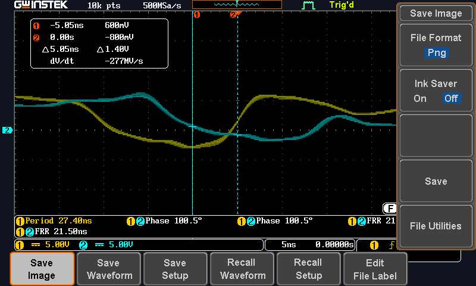
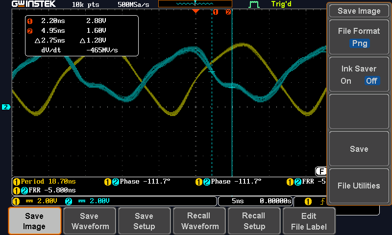
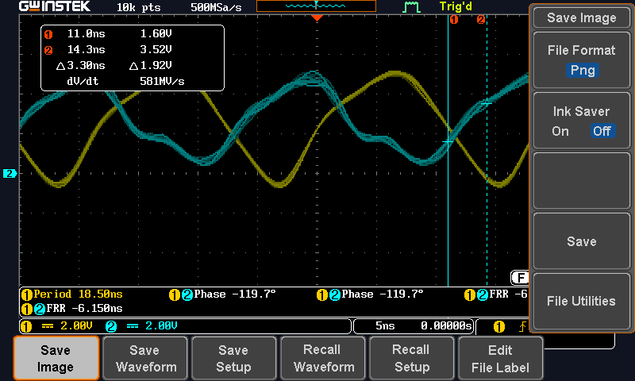
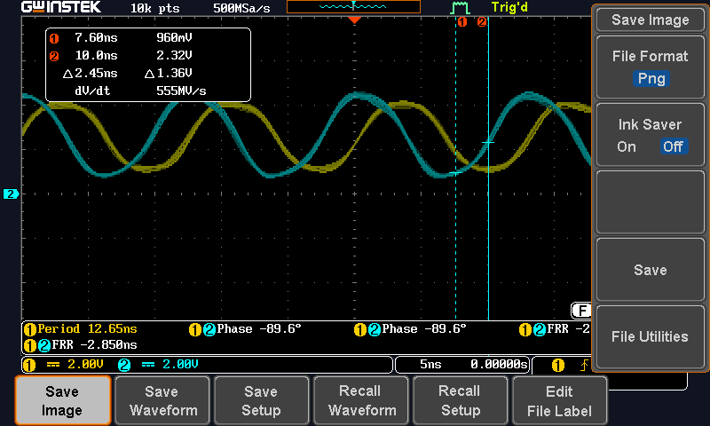
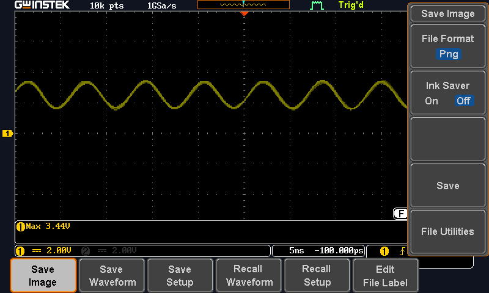

# Oscilador de anillo

**Bermúdez, Dilana — Chavarría, Desireé**  
**Correos:** dibermudez@estudiantec.cr — schavarria@estudiantec.cr  
**Fecha:** 17 de septiembre, 2026

---

## 1. Objetivos

### 1.1. Objetivo general

Caracterizar experimentalmente el comportamiento temporal de un inversor 74HC04 mediante la construcción de un oscilador de anillo, relacionando su frecuencia y período de oscilación con el retardo de propagación de las compuertas lógicas.

### 1.2. Objetivos específicos

- Construir un oscilador de anillo empleando un número impar de inversores 74HC04.
- Medir el período y la frecuencia de oscilación mediante un osciloscopio digital.
- Estimar el retardo de propagación promedio de una compuerta inversora.
- Comparar el comportamiento del circuito al modificar el número de inversores.
- Analizar el efecto de la longitud del alambrado sobre la temporización del circuito.
- Observar el comportamiento de un único inversor cuando su salida se realimenta hacia su entrada.

### 1.3. Retardo de propagación

Una compuerta lógica real no cambia instantáneamente su salida cuando cambia su entrada. El intervalo de tiempo requerido para que el efecto de una transición de entrada pueda observarse en la salida se denomina **retardo de propagación**.

Para un inversor pueden definirse dos retardos principales:

$$
t_{PHL}
$$

correspondiente a una transición de salida de nivel alto a nivel bajo, y

$$
t_{PLH}
$$

correspondiente a una transición de nivel bajo a nivel alto.

El retardo promedio puede aproximarse como

$$
t_{pd}=\frac{t_{PHL}+t_{PLH}}{2}
$$

La medición se realiza utilizando como referencia el punto correspondiente aproximadamente al 50 % de la excursión total de las señales.

Además del retardo de propagación, se consideran los tiempos de subida y bajada:

$$
t_r=t_{90\%}-t_{10\%}
$$

$$
t_f=t_{10\%}-t_{90\%}
$$

Estos parámetros permiten caracterizar la velocidad real de transición de una compuerta lógica.

### 1.4. Oscilador de anillo

Un oscilador de anillo se construye conectando en cascada un número impar de inversores y realimentando la salida del último inversor hacia la entrada del primero.

Idealmente, una cadena con un número impar de inversiones no puede alcanzar simultáneamente un estado lógico estático consistente, debido a que la señal realimentada posee siempre el valor lógico complementario.

En un circuito real, cada inversor introduce un pequeño retardo de propagación. La transición debe recorrer todas las compuertas del anillo antes de regresar a la entrada.

Si el anillo contiene $N$ inversores y cada inversor posee un retardo promedio $t_{pd}$, el cambio requiere aproximadamente

$$
N t_{pd}
$$

para propagarse una vez alrededor del circuito.

Para regresar al estado inicial se requieren dos recorridos, por lo que el período se aproxima mediante

$$
T\approx 2Nt_{pd}
$$

y por tanto

$$
t_{pd}\approx\frac{T}{2N}
$$

La frecuencia correspondiente es

$$
f=\frac{1}{T}
$$

y sustituyendo la expresión del período:

$$
f\approx\frac{1}{2Nt_{pd}}
$$

Por consiguiente, si se reduce el número de inversores, se espera una reducción del período y un aumento de la frecuencia.

---

## 2. Equipo utilizado

Para el desarrollo del experimento se utilizó el siguiente equipo:

- Circuito integrado 74HC04.
- Protoboard.
- Fuente de alimentación de 5 V.
- Osciloscopio digital GW Instek GDS-1202B.
- Dos sondas de osciloscopio.
- Cables de conexión.
- Pieza de conductor de aproximadamente 1 m.
- Capacitor de 0,01 µF para la etapa final del experimento.

---

## 3. Procedimiento experimental

Inicialmente se alimentó el circuito integrado 74HC04 empleando una tensión de aproximadamente 5 V. Posteriormente se conectaron cinco inversores en cascada y la salida del último inversor se realimentó hacia la entrada del primero.

La conexión utilizada fue:

```text
2 → 3, 4 → 5, 6 → 13, 12 → 11, 10 → 1
```

Las terminales de alimentación correspondieron a:

```text
14 → VCC, 7 → GND
```

Se colocaron las sondas del osciloscopio en diferentes salidas de las compuertas para observar simultáneamente las señales en etapas consecutivas.

Posteriormente se modificó el anillo utilizando tres inversores y se repitieron las mediciones.

También se realizó la prueba indicada en la guía agregando una pieza de alambre de aproximadamente un metro al lazo del oscilador.

Finalmente se realimentó directamente un único inversor y se observó el voltaje resultante.

---

## 4. Resultados experimentales

### 4.1. Formas de onda obtenidas

En la Figura 1 se presenta una de las formas de onda registradas experimentalmente.



**Figura 1.** Formas de onda medidas en dos etapas del oscilador de anillo.

Se observa que las señales correspondientes a etapas consecutivas presentan aproximadamente una inversión entre sí. Esto concuerda con el comportamiento esperado de las compuertas NOT.

Las formas de onda no son completamente cuadradas. A las frecuencias alcanzadas por el oscilador, las capacitancias parásitas de la protoboard, de las entradas del circuito integrado y de las sondas del osciloscopio adquieren importancia. Debido a ello, los flancos presentan un comportamiento redondeado.

### 4.2. Medición del período

Una de las mediciones automáticas del osciloscopio produjo el período

$$
T=27,40\text{ ns}
$$

como se observa en la Figura 2.



**Figura 2.** Medición del período mediante el osciloscopio.

La frecuencia correspondiente se calcula mediante

$$
f=\frac{1}{T}
$$

$$
=\frac{1}{27,40\times10^{-9}}
$$

$$
=3,65\times10^7\text{ Hz}
$$

Por lo tanto,

$$
f\approx36,5\text{ MHz}
$$

### 4.3. Estimación del retardo promedio con cinco inversores

Para un anillo formado por cinco inversores,

$$
N=5
$$

A partir de la ecuación

$$
t_{pd}=\frac{T}{2N}
$$

se obtiene

$$
t_{pd}=\frac{27,40\text{ ns}}{2(5)}
$$

$$
=\frac{27,40\text{ ns}}{10}
$$

Por tanto,

$$
t_{pd}\approx2,74\text{ ns}
$$

Este valor representa una estimación experimental del retardo promedio por inversor bajo las condiciones particulares de montaje y carga del experimento.

### 4.4. Mediciones mediante cursores

También se utilizaron los cursores del osciloscopio para estimar directamente la separación temporal entre transiciones de señales correspondientes a etapas consecutivas.

En uno de los registros se obtuvo

$$
\Delta t=2,75\text{ ns}
$$

como se muestra en la Figura 3.



**Figura 3.** Medición temporal mediante cursores: $\Delta t=2,75$ ns.

En otra transición se obtuvo

$$
\Delta t=3,30\text{ ns}
$$

como se muestra en la Figura 4.



**Figura 4.** Medición temporal mediante cursores: $\Delta t=3,30$ ns.

Tomando estos valores como estimaciones de los dos retardos de transición:

$$
t_{PHL}\approx2,75\text{ ns}
$$

y

$$
t_{PLH}\approx3,30\text{ ns}
$$

el retardo promedio resulta

$$
t_{pd}=\frac{t_{PHL}+t_{PLH}}{2}
$$

$$
=\frac{2,75+3,30}{2}\text{ ns}
$$

$$
=3,025\text{ ns}
$$

Por lo tanto,

$$
t_{pd,\text{cursores}}\approx3,03\text{ ns}
$$

Este resultado es cercano al obtenido mediante el período completo del oscilador,

$$
t_{pd,\text{anillo}}\approx2,74\text{ ns}
$$

La diferencia absoluta es

$$
\Delta t_{pd}=3,03-2,74=0,29\text{ ns}
$$

Tomando la medición mediante cursores como referencia, la diferencia relativa aproximada es

$$
\varepsilon=\frac{|3,03-2,74|}{3,03}\times100\approx9,6\%
$$

La concordancia entre ambos procedimientos permite comprobar experimentalmente la relación entre el período del oscilador y el retardo de propagación de sus etapas.

### 4.5. Oscilador con tres inversores

Al reducir el número de inversores se observó un período menor. En una de las configuraciones se registró

$$
T=18,50\text{ ns}
$$

y una medición muy próxima de

$$
T=18,70\text{ ns}
$$

Tomando el valor de 18,50 ns:

$$
f=\frac{1}{18,50\times10^{-9}}
$$

$$
\approx54,05\text{ MHz}
$$

Por tanto,

$$
f\approx54,1\text{ MHz}
$$

Para tres inversores:

$$
t_{pd}=\frac{T}{2N}
$$

$$
=\frac{18,50\text{ ns}}{2(3)}
$$

$$
=\frac{18,50\text{ ns}}{6}
$$

$$
\approx3,08\text{ ns}
$$

Por lo tanto,

$$
t_{pd}\approx3,08\text{ ns}
$$

Este resultado presenta una concordancia especialmente buena con el valor obtenido utilizando directamente los cursores:

$$
t_{pd,\text{cursores}}\approx3,03\text{ ns}
$$

La diferencia es únicamente

$$
|3,08-3,03|=0,05\text{ ns}
$$

### 4.6. Comparación entre cinco y tres inversores

Los resultados principales se resumen en la Tabla 1.

| Configuración | $T$ [ns] | $f$ [MHz] | $t_{pd}$ [ns] |
|---|---:|---:|---:|
| 5 inversores | 27,40 | 36,50 | 2,74 |
| 3 inversores | 18,50 | 54,05 | 3,08 |
| Cursores | — | — | 3,03 |

**Tabla 1.** Comparación de las configuraciones medidas.

Al pasar de cinco a tres inversores se produjo una disminución del período de oscilación y, en consecuencia, un aumento de la frecuencia.

Este resultado coincide con

$$
f\approx\frac{1}{2Nt_{pd}}
$$

ya que una reducción en $N$ disminuye el tiempo requerido para que una transición complete un recorrido alrededor del anillo.

### 4.7. Registro adicional

En otro registro experimental se obtuvo

$$
T=12,65\text{ ns}
$$

como se muestra en la Figura 5.



**Figura 5.** Registro adicional con período de aproximadamente 12,65 ns.

La frecuencia correspondiente es

$$
f=\frac{1}{12,65\times10^{-9}}
$$

$$
\approx79,05\text{ MHz}
$$

Por tanto,

$$
f\approx79,1\text{ MHz}
$$

Este archivo se conserva como una medición experimental adicional. Debido a que los archivos exportados por el osciloscopio no almacenan una descripción textual de la configuración física del circuito, no se asigna este registro a una configuración específica sin corroborar la bitácora de montaje.

### 4.8. Efecto de un conductor largo

La guía de laboratorio solicita agregar aproximadamente 1 m de alambre al anillo de tres inversores.

Un conductor real posee parámetros distribuidos de resistencia, inductancia y capacitancia. Además, cualquier señal electromagnética requiere un tiempo finito para propagarse a lo largo del conductor.

En consecuencia, una longitud adicional de cable puede modificar:

- el retardo total del lazo;
- la capacitancia equivalente observada por las salidas;
- los tiempos de subida y bajada;
- la amplitud de la señal;
- la frecuencia de oscilación;
- la forma de onda medida.

El modelo simplificado del oscilador puede modificarse escribiendo

$$
T\approx2\left(Nt_{pd}+t_{cable}\right)
$$

En condiciones ideales, un incremento en el retardo total implica

$$
T_{cable}>T_{\text{sin cable}}
$$

y por consiguiente

$$
f_{cable}<f_{\text{sin cable}}
$$

No obstante, a frecuencias de decenas de megahercios también intervienen efectos de carga, reflexiones y capacitancias parásitas, por lo que el resultado experimental debe analizarse a partir de la forma de onda real.

### 4.9. Realimentación de un único inversor

Finalmente se conectó la salida de un solo inversor directamente a su entrada.

La captura obtenida se muestra en la Figura 6.



**Figura 6.** Comportamiento observado con un único inversor realimentado.

En la captura se registró un valor máximo aproximado de

$$
V_{\max}\approx3,44\text{ V}
$$

La realimentación de un número impar de inversiones produce una condición en la cual la salida intenta establecer permanentemente el estado opuesto a la entrada.

En una compuerta real, el retardo de propagación y el comportamiento analógico interno permiten que aparezcan variaciones alrededor del punto de transición. Por esta razón la tensión observada no debe interpretarse únicamente mediante el modelo digital ideal de niveles lógicos 0 y 1.

La guía propone conectar un capacitor de

$$
C=0,01\ \mu\text{F}
$$

entre el nodo realimentado y tierra si la tensión no permanece estable. El capacitor reduce las variaciones rápidas de tensión y modifica la dinámica temporal del circuito.

---

## 5. Análisis de resultados

Los resultados obtenidos muestran claramente la existencia de un retardo de propagación finito en las compuertas 74HC04.

A partir del oscilador de cinco inversores se obtuvo un retardo promedio aproximado de

$$
t_{pd}\approx2,74\text{ ns}
$$

mientras que la medición directa utilizando cursores produjo

$$
t_{pd}\approx3,03\text{ ns}
$$

Por otra parte, para una configuración cuyo período medido fue de 18,50 ns y empleando tres inversores, se obtiene

$$
t_{pd}\approx3,08\text{ ns}
$$

Los tres resultados se encuentran en el mismo orden de magnitud y presentan una buena concordancia experimental.

La diferencia entre ellos puede atribuirse a que el retardo de una compuerta no es una constante absoluta. Este parámetro depende de factores como:

- tensión de alimentación;
- carga capacitiva;
- longitud del alambrado;
- características individuales del circuito integrado;
- capacitancia de las sondas del osciloscopio;
- tiempos de subida y bajada;
- temperatura;
- parásitos introducidos por la protoboard.

También se observó que las formas de onda se aproximan más a señales redondeadas que a ondas cuadradas ideales. Esto ocurre porque la frecuencia de operación se encuentra en el rango de decenas de megahercios y, por tanto, los elementos parásitos del montaje adquieren una influencia significativa.

Debe señalarse además que las mediciones automáticas del osciloscopio pueden identificar ocasionalmente componentes armónicas de una señal deformada. Por esta razón resulta conveniente comparar la lectura automática de período con la forma de onda, los cursores y el procesamiento de los archivos CSV.

---

## 6. Fuentes de incertidumbre experimental

Las principales fuentes de incertidumbre observadas durante el experimento fueron:

1. **Carga de las sondas:** las sondas agregan resistencia y capacitancia al nodo medido.
2. **Protoboard:** la protoboard introduce capacitancias e inductancias parásitas.
3. **Longitud de los cables:** los conductores largos modifican el retardo y la carga del circuito.
4. **Selección de los cursores:** pequeños desplazamientos en la posición del cruce al 50 % modifican apreciablemente una medición del orden de nanosegundos.
5. **Frecuencia elevada:** a decenas de megahercios la aproximación de circuito concentrado pierde precisión y los conductores comienzan a presentar efectos distribuidos.
6. **Forma de onda no ideal:** la presencia de armónicos puede afectar algunas mediciones automáticas del osciloscopio.

---

## 7. Conclusiones

La construcción del oscilador de anillo permitió comprobar experimentalmente que las compuertas lógicas presentan un retardo de propagación finito.

La relación

$$
T\approx2Nt_{pd}
$$

permitió determinar el retardo promedio del inversor a partir del período de oscilación.

Para las mediciones analizadas se obtuvieron valores de $t_{pd}$ del orden de

$$
t_{pd}\approx3\text{ ns}
$$

lo cual fue corroborado tanto mediante el período completo del oscilador como mediante mediciones directas entre etapas consecutivas usando los cursores del osciloscopio.

Asimismo, se comprobó que reducir el número de inversores disminuye el tiempo total de recorrido de la señal alrededor del anillo y, por tanto, incrementa la frecuencia de oscilación.

Las formas de onda obtenidas evidenciaron además que, a frecuencias del orden de decenas de megahercios, el comportamiento del circuito no puede considerarse completamente ideal. Las capacitancias parásitas, las sondas, la protoboard y el alambrado producen modificaciones visibles en los tiempos de transición y en la forma de la señal.

Finalmente, el experimento permitió relacionar de manera directa los conceptos teóricos de temporización digital con una implementación física, mostrando que incluso una operación lógica tan sencilla como la inversión posee restricciones temporales que deben considerarse en el diseño de sistemas digitales de alta velocidad.

---

## Referencia

S. L. Harris y D. Harris, *Digital Design and Computer Architecture: RISC-V Edition*, Morgan Kaufmann, 2022.
